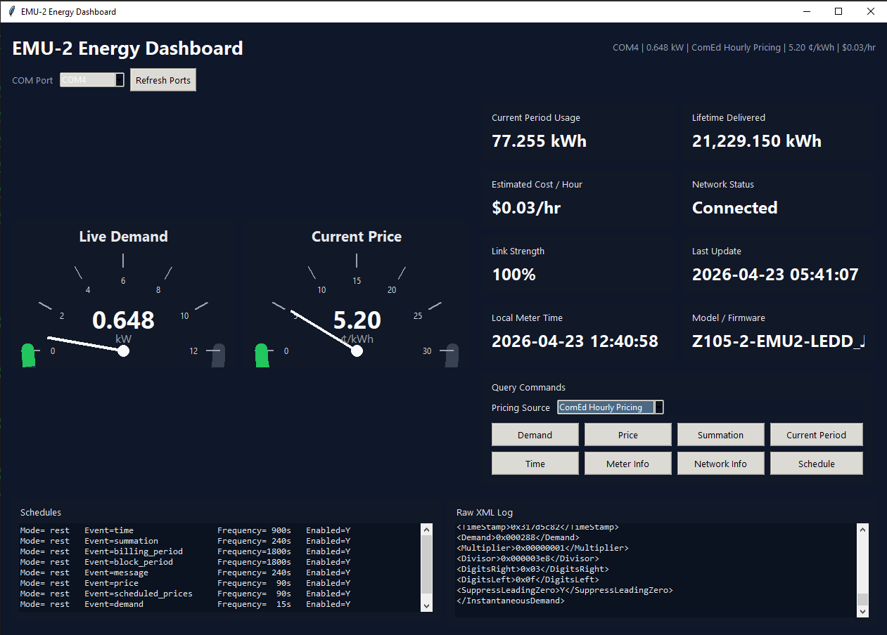

# EMU-2 Smart Meter Data Dashboard

Desktop dashboard for reading live EMU-2 smart meter data over a serial connection and presenting it in a simple Tkinter UI.



## Features

- Live demand gauge in kW.
- Current price gauge with selectable pricing source:
  - No Pricing Source
  - EMU-2 Price
  - ComEd Hourly Pricing
- ComEd pricing integration using the latest feed from `https://hourlypricing.comed.com/api?type=5minutefeed`.
- Estimated cost per hour based on live demand and the active pricing source.
- Current period usage and lifetime delivered energy cards.
- Network status and link strength display, with link strength shown as a percentage.
- Local meter time, firmware, and model details.
- Schedule viewer and raw XML log panel.
- COM port selector with saved preferred port.
- Automatic reconnect with a 3 second retry delay if the EMU-2 is unavailable or disconnects.
- Saved preferred pricing source across app restarts.

## Requirements

- Python 3.10+
- `pyserial`
- An EMU-2 connected over a serial COM port

## Install

```powershell
pip install pyserial
```

## Run

```powershell
python dashboard.py
```

## Notes

- The app stores user preferences in `dashboard_config.json`.
- If `ComEd Hourly Pricing` is selected, the dashboard uses the ComEd feed for the price gauge and estimated hourly cost instead of the EMU-2 price cluster value.
